# Deeplearningsee
Below are **detailed exam-oriented answers for UNIT–II**, prepared strictly according to your instructions and based on the uploaded syllabus. 

All questions are written exactly as given, and diagrams (where required) are provided in **Mermaid syntax**.

---

# ✅ **UNIT – II : CONVOLUTIONAL NEURAL NETWORK FUNDAMENTALS**

---

## **Question 1: Compare CNNs with fully connected neural networks in terms of parameters, locality, and inductive bias.**

### **Answer:**

### 1. Introduction

Convolutional Neural Networks (CNNs) and Fully Connected Neural Networks (FCNNs) are both deep learning models, but they differ significantly in structure and functionality.

---

### 2. Comparison Based on Parameters

#### (a) Fully Connected Neural Networks (FCNNs)

* Every neuron connects to all neurons in the previous layer.
* Large number of parameters.
* Parameter count grows rapidly with input size.

Example:
For 224×224×3 image:
[
224 \times 224 \times 3 = 150,528 \text{ inputs}
]
Connecting to 1000 neurons:
[
150,528 \times 1000 = 150M \text{ parameters}
]

---

#### (b) CNNs

* Uses small filters (e.g., 3×3).
* Parameters shared across spatial locations.
* Much fewer parameters.

Example:
3×3 filter with 3 channels:
[
3 \times 3 \times 3 = 27 \text{ parameters}
]

---

### 3. Locality

| Aspect             | FCNN | CNN    |
| ------------------ | ---- | ------ |
| Local Connectivity | No   | Yes    |
| Spatial Awareness  | No   | Yes    |
| Feature Hierarchy  | Weak | Strong |

CNNs exploit spatial locality, while FCNNs ignore image structure.

---

### 4. Inductive Bias

Inductive bias refers to built-in assumptions in a model.

* FCNN: No assumption about spatial structure.
* CNN: Assumes nearby pixels are related (local correlation).

CNN bias:

* Translation invariance
* Local patterns matter

---

### 5. Conclusion

CNNs are more efficient, parameter-friendly, and suitable for image tasks due to locality and spatial inductive bias.

---

## **Question 2: Analyze the effect of padding and stride on receptive fields and output resolution using suitable examples.**

### **Answer:**

### 1. Definitions

* **Padding**: Adding zeros around input.
* **Stride**: Step size of filter movement.
* **Receptive Field**: Region of input influencing one output neuron.

---

### 2. Output Size Formula

[
Output = \frac{(W - F + 2P)}{S} + 1
]

Where:

* W = Input size
* F = Filter size
* P = Padding
* S = Stride

---

### 3. Effect of Padding

#### Without Padding (Valid)

Example:
W=5, F=3, P=0, S=1

[
Output = (5-3)/1 +1 = 3
]

Shrinks output.

#### With Padding (Same)

W=5, F=3, P=1, S=1

[
Output = (5-3+2)/1 +1 = 5
]

Preserves size.

---

### 4. Effect of Stride

If S=2:

W=5, F=3, P=0

[
Output = (5-3)/2 +1 = 2
]

Reduces resolution.

---

### 5. Receptive Field Impact

* Larger stride → Larger effective receptive jump
* Padding preserves border information

---

### 6. Conclusion

Padding preserves resolution; stride controls downsampling and receptive field expansion.

---

## **Question 3: Evaluate the role of ReLU and pooling in feature extraction and model generalization.**

### **Answer:**

### 1. ReLU (Rectified Linear Unit)

[
f(x) = max(0, x)
]

#### Role:

* Introduces non-linearity
* Prevents vanishing gradient
* Faster convergence

---

### 2. Pooling

Common types:

* Max pooling
* Average pooling

#### Role:

* Reduces spatial size
* Controls overfitting
* Provides translation invariance

---

### 3. Combined Effect

| Component | Role                         |
| --------- | ---------------------------- |
| ReLU      | Activates important features |
| Pooling   | Reduces noise                |

---

### 4. Conclusion

ReLU enhances feature learning; pooling improves generalization and robustness.

---

## **Question 4: Explain the typical layer ordering in a CNN pipeline and justify the design choices.**

### **Answer:**

### 1. Typical Order

Input → Conv → ReLU → Pool → Conv → ReLU → Pool → FC → Softmax

---

### 2. Diagram

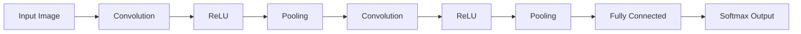

---

### 3. Justification

* Convolution: Feature extraction
* ReLU: Non-linearity
* Pooling: Downsampling
* FC: Classification

---

### 4. Conclusion

Layer ordering ensures progressive abstraction from low-level to high-level features.

---

## **Question 5: Construct a CNN block diagram for image classification and annotate each component with its function.**

### **Answer:**

### CNN Block Diagram

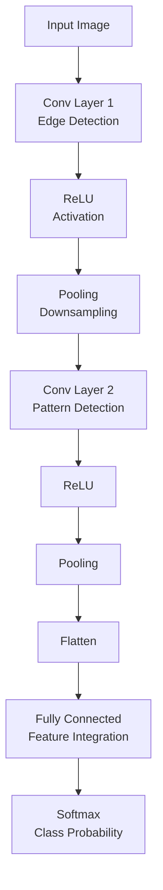

---

### Explanation

* Conv: Extracts features
* ReLU: Adds non-linearity
* Pooling: Reduces dimensions
* Flatten: Converts to vector
* FC: Combines features
* Softmax: Output probabilities

---

## **Question 6: Assess the computational trade-offs between deeper CNNs and wider CNNs.**

### **Answer:**

### 1. Deeper CNNs

* More layers
* Higher representational power
* More training time
* Risk of vanishing gradients

---

### 2. Wider CNNs

* More filters per layer
* Parallel feature learning
* Higher memory usage
* Faster convergence

---

### 3. Comparison

| Aspect        | Deeper   | Wider    |
| ------------- | -------- | -------- |
| Accuracy      | High     | Moderate |
| Training Time | High     | Moderate |
| Memory        | Moderate | High     |
| Overfitting   | Higher   | Lower    |

---

### 4. Conclusion

Depth increases abstraction; width increases feature diversity.

---

## **Question 7: Analyze how data augmentation improves CNN robustness, referring to at least three augmentation types.**

### **Answer:**

### 1. Purpose

Data augmentation artificially increases dataset size.

---

### 2. Types

#### (a) Rotation

* Rotates image
* Handles orientation variation

#### (b) Flipping

* Horizontal/Vertical
* Improves invariance

#### (c) Scaling

* Zoom in/out
* Improves scale invariance

---

### 3. Impact

* Reduces overfitting
* Improves generalization
* Enhances robustness

---

### 4. Conclusion

Data augmentation makes CNNs robust to variations.

---

## **Question 8: Describe backpropagation through convolution layers and relate it to matrix multiplication form.**

### **Answer:**

### 1. Forward Pass

Convolution:
[
Y = X * W
]

---

### 2. Backpropagation

Compute gradients:

* ∂Loss/∂W
* ∂Loss/∂X

Uses chain rule.

---

### 3. Matrix Form

Convolution can be converted to matrix multiplication using **im2col**.

[
Y = X_{col} \cdot W_{row}
]

Gradient:

[
\frac{\partial L}{\partial W} = X_{col}^T \cdot \frac{\partial L}{\partial Y}
]

---

### 4. Conclusion

Backpropagation in CNN is equivalent to matrix multiplication in transformed space.

---

## **Question 9: Develop a CNN feature-extraction pipeline for a real-world vision task of your choice.**

### **Answer:**

### Task: Face Recognition

---

### Pipeline Diagram

---

### Explanation

* Preprocessing: Resize, normalize
* CNN: Extract features
* Embedding: Compact representation
* Matching: Compare with database

---

### Conclusion

CNN-based feature extraction provides robust facial embeddings.

---

## **Question 10: Explain how overfitting arises in CNN training and propose mitigation strategies.**

### **Answer:**

### 1. Causes

* Small dataset
* Large model
* Too many parameters

---

### 2. Symptoms

* High training accuracy
* Low validation accuracy

---

### 3. Mitigation Strategies

* Dropout
* Data augmentation
* Early stopping
* Regularization
* Batch normalization

---

### 4. Conclusion

Overfitting occurs due to model complexity and limited data; mitigation improves generalization.

---

## **Question 11: Propose evaluation metrics suitable for CNN-based classification models and justify your choices.**

### **Answer:**

### 1. Accuracy

[
Accuracy = \frac{Correct}{Total}
]

---

### 2. Precision

[
Precision = \frac{TP}{TP+FP}
]

---

### 3. Recall

[
Recall = \frac{TP}{TP+FN}
]

---

### 4. F1 Score

[
F1 = 2 \times \frac{Precision \times Recall}{Precision + Recall}
]

---

### 5. Justification

* Accuracy: Balanced data
* Precision: False positive control
* Recall: False negative control
* F1: Imbalanced datasets

---

### 6. Conclusion

Multiple metrics provide comprehensive evaluation.

---

## **Question 12: Analyze how interleaving convolution and pooling layers impacts translation invariance.**

### **Answer:**

### 1. Convolution

Detects local features.

---

### 2. Pooling

Reduces spatial sensitivity.

---

### 3. Interleaving Effect

Conv → Pool → Conv → Pool

* Increases abstraction
* Enhances translation invariance

---

### 4. Conclusion

Interleaving ensures robust spatial invariance and hierarchical learning.

---

## **Question 13: Describe the importance of normalization layers such as LRN or batch normalization in CNN training stability.**

### **Answer:**

### 1. Batch Normalization

Normalizes activations:

[
\hat{x} = \frac{x - \mu}{\sigma}
]

---

### 2. Benefits

* Reduces internal covariate shift
* Speeds up training
* Allows higher learning rates
* Improves stability

---

### 3. LRN

* Encourages competition among neurons
* Used in early CNNs

---

### 4. Conclusion

Normalization layers stabilize and accelerate CNN training.

---

## **Question 14: Design a conceptual experiment to measure the impact of stride and filter size on model accuracy.**

### **Answer:**

### Experimental Design

1. Dataset: CIFAR-10
2. Model: Simple CNN
3. Vary stride: 1 vs 2
4. Vary filter: 3×3 vs 5×5
5. Keep other parameters constant
6. Compare validation accuracy

---

### Diagram

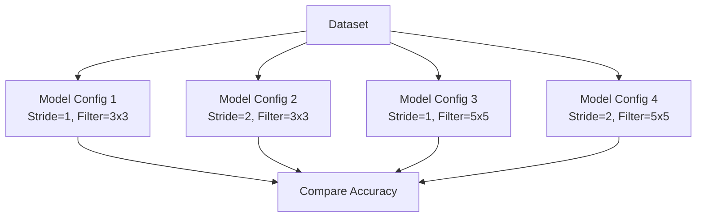

---

### Expected Result

* Smaller stride → Higher accuracy
* Moderate filter size → Better generalization

---

## **Question 15: Evaluate the scalability of CNNs when applied to large-scale image datasets and industrial systems.**

### **Answer:**

### 1. Scalability Advantages

* Parallel computation (GPU)
* Distributed training
* Transfer learning

---

### 2. Challenges

* High memory usage
* Long training time
* Deployment cost

---

### 3. Industrial Solutions

* Cloud computing
* Model compression
* Edge AI

---

### 4. Conclusion

CNNs scale well with hardware support but require optimization for industrial deployment.

---

# ✅ **UNIT – III : CONVOLUTIONAL NEURAL NETWORK ARCHITECTURES AND APPLICATIONS**

---

## **Question 1: Analyze the motivation for residual learning in ResNet and evaluate its impact on training very deep networks.**

### **Answer:**

### 1. Introduction

As neural networks became deeper, researchers observed that increasing depth did not always improve performance. Instead, very deep networks suffered from optimization problems. To overcome this, **Residual Networks (ResNet)** introduced the concept of **residual learning**.

---

### 2. Motivation for Residual Learning

The main motivations are:

#### (a) Degradation Problem

* When depth increases, accuracy sometimes decreases.
* This happens even when overfitting is not present.
* It indicates optimization difficulty.

#### (b) Vanishing Gradient Problem

* During backpropagation, gradients become very small.
* Early layers learn very slowly.
* Training becomes inefficient.

#### (c) Difficulty in Learning Identity Mapping

* Ideally, deeper layers should learn identity if no improvement is possible.
* Standard CNNs find this difficult.

---

### 3. Residual Learning Concept

Instead of learning:

[
H(x)
]

ResNet learns:

[
F(x) = H(x) - x
]

So,

[
H(x) = F(x) + x
]

Where:

* ( x ) = input
* ( F(x) ) = residual mapping

This is implemented using **skip connections**.

---

### 4. Residual Block Structure

A residual block contains:

* Convolution layer
* Batch normalization
* ReLU
* Skip connection
* Addition operation

Output:

[
y = F(x) + x
]

---

### 5. Impact on Training Deep Networks

#### (a) Easier Optimization

* Network learns only residuals.
* Simplifies learning.

#### (b) Better Gradient Flow

* Skip connections allow gradients to flow directly.
* Reduces vanishing gradients.

#### (c) Enables Very Deep Networks

* ResNet models up to 152 layers.
* Stable training.

#### (d) Higher Accuracy

* Improved performance on large datasets.
* Better generalization.

---

### 6. Evaluation

| Aspect             | Without Residual Learning | With Residual Learning |
| ------------------ | ------------------------- | ---------------------- |
| Training Stability | Poor                      | Excellent              |
| Gradient Flow      | Weak                      | Strong                 |
| Depth Limit        | Low                       | Very High              |
| Accuracy           | Moderate                  | High                   |

---

### 7. Conclusion

Residual learning solves degradation and optimization problems and enables the training of extremely deep CNNs with high accuracy and stability.

---

## **Question 2: Evaluate the role of the Inception module in GoogLeNet in balancing accuracy and computation.**

### **Answer:**

### 1. Introduction

GoogLeNet introduced the **Inception module** to improve accuracy while reducing computational cost.

---

### 2. Design Philosophy

The Inception module uses:

* Multiple filter sizes in parallel
* Dimension reduction
* Efficient computation

---

### 3. Structure of Inception Module

It contains:

* 1×1 convolution
* 3×3 convolution
* 5×5 convolution
* Max pooling

All operate in parallel.

---

### 4. Role of 1×1 Convolution

Used for:

* Reducing channels
* Lowering parameters
* Increasing non-linearity

---

### 5. Balancing Accuracy and Computation

#### (a) Multi-Scale Feature Extraction

* Different filters capture different features.
* Improves representation.

#### (b) Reduced Parameters

* 1×1 convolutions reduce depth.
* Controls model size.

#### (c) Parallel Processing

* Multiple operations at once.
* Improves efficiency.

---

### 6. Performance Evaluation

| Feature     | Impact    |
| ----------- | --------- |
| Accuracy    | High      |
| Parameters  | Low       |
| Computation | Optimized |
| Speed       | Fast      |

---

### 7. Conclusion

The Inception module enables GoogLeNet to achieve high accuracy with low computational cost through parallel multi-scale processing and dimension reduction.

---

## **Question 3: Explain why ZFNet refined AlexNet and outline what was improved.**

### **Answer:**

### 1. Introduction

ZFNet (Zeiler and Fergus Network) was developed to improve AlexNet using better visualization and optimization.

---

### 2. Limitations of AlexNet

* Large stride in first layer
* Information loss
* Poor visualization
* Suboptimal filters

---

### 3. Improvements in ZFNet

#### (a) Reduced Stride

* AlexNet: stride = 4
* ZFNet: stride = 2
* Better feature preservation

#### (b) Smaller Filters

* Improved resolution

#### (c) Deconvolution Visualization

* Visualized feature maps
* Helped optimize architecture

#### (d) Better Hyperparameters

* Learning rate tuning
* Improved normalization

---

### 4. Performance Impact

| Aspect          | AlexNet  | ZFNet  |
| --------------- | -------- | ------ |
| Accuracy        | Lower    | Higher |
| Visualization   | Poor     | Good   |
| Feature Quality | Moderate | Better |

---

### 5. Conclusion

ZFNet refined AlexNet by improving visualization, reducing stride, and optimizing filters, leading to better accuracy.

---

## **Question 4: Construct a comparison matrix of AlexNet, VGG, GoogLeNet, and ResNet based on accuracy, complexity, and application suitability.**

### **Answer:**

| Parameter           | AlexNet      | VGG       | GoogLeNet    | ResNet      |
| ------------------- | ------------ | --------- | ------------ | ----------- |
| Depth               | 8            | 16–19     | 22           | 50–152      |
| Parameters          | High         | Very High | Low          | Moderate    |
| Accuracy            | Moderate     | High      | High         | Very High   |
| Complexity          | Medium       | High      | Medium       | High        |
| Training Difficulty | Low          | High      | Medium       | Low         |
| Applications        | Basic Vision | Research  | Mobile/Cloud | Advanced AI |

---

### Conclusion

ResNet provides the best accuracy, VGG offers simplicity, GoogLeNet balances efficiency, and AlexNet is suitable for basic tasks.

---

## **Question 5: Assess the benefits and limitations of using pretrained CNN models for transfer learning.**

### **Answer:**

### 1. Introduction

Transfer learning uses pretrained models trained on large datasets for new tasks.

---

### 2. Benefits

#### (a) Reduced Training Time

* No need to train from scratch.

#### (b) Less Data Requirement

* Works well with small datasets.

#### (c) High Accuracy

* Uses learned representations.

#### (d) Lower Cost

* Saves computational resources.

---

### 3. Limitations

#### (a) Domain Mismatch

* Different data reduces effectiveness.

#### (b) Limited Customization

* Architecture is fixed.

#### (c) Overfitting Risk

* Small datasets may overfit.

#### (d) Large Model Size

* Memory intensive.

---

### 4. Evaluation Table

| Aspect   | Advantage | Limitation       |
| -------- | --------- | ---------------- |
| Time     | Fast      | Limited tuning   |
| Data     | Low need  | Domain dependent |
| Accuracy | High      | Task specific    |

---

### 5. Conclusion

Transfer learning is effective for limited data scenarios but suffers when domain differences are large.

---

## **Question 6: Analyze how CNNs are applied in Content-Based Image Retrieval (CBIR) and justify their effectiveness.**

### **Answer:**

### 1. Introduction

CBIR retrieves images based on visual content instead of text.

---

### 2. CNN-Based CBIR Pipeline

1. Input image
2. CNN feature extraction
3. Feature vector storage
4. Similarity comparison
5. Result ranking

---

### 3. Role of CNNs

* Extract deep semantic features
* Reduce manual feature design
* Capture texture, color, and shape

---

### 4. Effectiveness

#### (a) Semantic Understanding

* Better than traditional methods

#### (b) Robustness

* Handles noise and variations

#### (c) Scalability

* Works on large databases

---

### 5. Conclusion

CNNs improve CBIR by providing discriminative, robust, and semantic feature representations.

---

## **Question 7: Describe a CNN-based pipeline for object detection including feature extraction and bounding-box prediction.**

### **Answer:**

### 1. Introduction

Object detection identifies objects and their locations in images.

---

### 2. Pipeline Steps

1. Image Input
2. Convolution Layers (Feature Extraction)
3. Region Proposal
4. ROI Pooling
5. Classification
6. Bounding Box Regression
7. Output Prediction

---

### 3. Feature Extraction

* CNN extracts hierarchical features.
* Lower layers: edges
* Higher layers: objects

---

### 4. Bounding Box Prediction

Uses regression to predict:

[
(x, y, w, h)
]

Where:

* x, y = center
* w, h = width and height

---

### 5. Conclusion

CNNs integrate feature learning and localization for accurate object detection.

---

## **Question 8: Develop a conceptual workflow for object localization using CNNs and propose evaluation measures.**

### **Answer:**

### 1. Workflow

1. Image input
2. CNN feature extraction
3. Sliding window / Region proposal
4. Localization network
5. Bounding box output
6. Post-processing

---

### 2. Evaluation Measures

#### (a) Intersection over Union (IoU)

[
IoU = \frac{Area\ of\ Overlap}{Area\ of\ Union}
]

#### (b) Precision

#### (c) Recall

#### (d) Mean Average Precision (mAP)

---

### 3. Conclusion

Object localization uses CNN features and is evaluated using IoU and mAP metrics.

---

## **Question 9: Explain how CNNs process temporal cues in video classification tasks.**

### **Answer:**

### 1. Introduction

Videos contain spatial and temporal information.

---

### 2. Processing Methods

#### (a) 2D CNN + RNN

* CNN extracts frames
* RNN models sequence

#### (b) 3D CNN

* Uses 3D filters
* Captures motion

#### (c) Two-Stream Networks

* Spatial stream
* Temporal stream

---

### 3. Temporal Feature Learning

* Motion patterns
* Frame dependencies
* Action dynamics

---

### 4. Conclusion

CNNs process temporal cues using 3D convolutions or hybrid models to capture motion information.

---

## **Question 10: Propose an NLP or sequence-learning task that leverages CNNs and justify the design choices.**

### **Answer:**

### 1. Proposed Task: Sentiment Analysis

Goal: Classify reviews as positive/negative.

---

### 2. Design

1. Word Embedding Layer
2. 1D Convolution
3. Max Pooling
4. Fully Connected
5. Softmax Output

---

### 3. Justification

* CNN captures n-gram features
* Parallel processing
* Efficient training
* Position invariant patterns

---

### 4. Conclusion

CNNs are effective for sentiment analysis due to fast and local feature extraction.

---

## **Question 11: Design a high-level system architecture using pretrained CNN models for a real-world industrial or societal application.**

### **Answer:**

### 1. Application: Medical Image Diagnosis

---

### 2. Architecture

1. Data Collection
2. Preprocessing
3. Pretrained CNN
4. Fine-Tuning
5. Classification Layer
6. Report Generation
7. Doctor Interface

---

### 3. Benefits

* Fast diagnosis
* Reduced workload
* High accuracy
* Cost effective

---

### 4. Conclusion

Pretrained CNNs enable reliable and scalable medical diagnosis systems.

---

## **Question 12: Describe how increasing network depth influences learning capacity and optimization challenges.**

### **Answer:**

### 1. Learning Capacity

* More layers = more representational power
* Learns complex patterns

---

### 2. Optimization Challenges

* Vanishing gradients
* Overfitting
* High computation
* Memory usage

---

### 3. Solutions

* Batch normalization
* Residual connections
* Dropout

---

### 4. Conclusion

Depth improves learning but increases training difficulty.

---

## **Question 13: Analyze the trade-offs between model depth, computation, and accuracy for deployment in resource-limited environments.**

### **Answer:**

### 1. Trade-offs

| Factor      | Impact           |
| ----------- | ---------------- |
| Depth       | Better accuracy  |
| Computation | Higher cost      |
| Memory      | More usage       |
| Speed       | Slower inference |

---

### 2. Optimization Techniques

* Model pruning
* Quantization
* Knowledge distillation
* Lightweight models

---

### 3. Conclusion

Shallow optimized models are preferred in resource-limited environments.

---

## **Question 14: Evaluate the effectiveness of CNN architectures in multi-domain applications such as healthcare, security, and multimedia analytics.**

### **Answer:**

### 1. Healthcare

* Disease detection
* X-ray analysis
* MRI segmentation

### 2. Security

* Face recognition
* Surveillance
* Intrusion detection

### 3. Multimedia Analytics

* Video tagging
* Image search
* Recommendation

---

### 4. Evaluation

| Domain     | Accuracy  | Reliability | Scalability |
| ---------- | --------- | ----------- | ----------- |
| Healthcare | High      | High        | Medium      |
| Security   | High      | Medium      | High        |
| Multimedia | Very High | High        | Very High   |

---

### 5. Conclusion

CNNs are highly effective across domains due to their feature learning and scalability.

---
Below are **detailed exam-oriented answers for UNIT–IV**, prepared strictly according to your instructions and based on the uploaded syllabus. 

All questions are written exactly as given, and diagrams (where required) are provided in **Mermaid syntax**.

---

# ✅ **UNIT – IV : RECURRENT NEURAL NETWORKS AND SEQUENCE MODELS**

---

## **Question 1: Trace the evolution of hidden states for a given short sequence using a basic RNN cell.**

### **Answer:**

### 1. Introduction

A Recurrent Neural Network (RNN) processes sequential data by maintaining a **hidden state** that captures past information.

At each time step, the hidden state is updated using the current input and previous hidden state.

---

### 2. Basic RNN Equation

[
h_t = f(W_x x_t + W_h h_{t-1} + b)
]

Where:

* ( x_t ) = input at time t
* ( h_t ) = hidden state
* ( W_x, W_h ) = weight matrices
* ( b ) = bias
* ( f ) = activation (tanh/ReLU)

---

### 3. Evolution of Hidden States

For sequence: ( x_1, x_2, x_3 )

[
h_1 = f(W_x x_1 + W_h h_0)
]

[
h_2 = f(W_x x_2 + W_h h_1)
]

[
h_3 = f(W_x x_3 + W_h h_2)
]

Each hidden state carries previous information.

---

### 4. Diagram

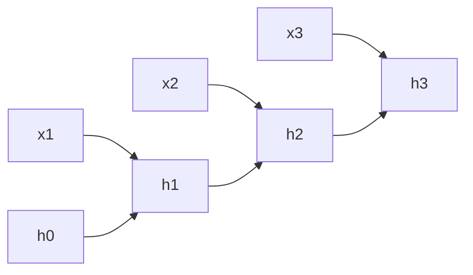

---

### 5. Conclusion

Hidden states evolve by recursively combining current inputs with past memory, enabling sequence learning.

---

## **Question 2: Analyze Backpropagation Through Time (BPTT) and justify why exploding/vanishing gradients occur.**

### **Answer:**

### 1. Introduction

Backpropagation Through Time (BPTT) is the training algorithm used for RNNs.

It unfolds the RNN over time and applies backpropagation.

---

### 2. Working of BPTT

Steps:

1. Unroll RNN for T time steps
2. Compute loss at each step
3. Propagate error backward
4. Update weights

---

### 3. Unrolled RNN

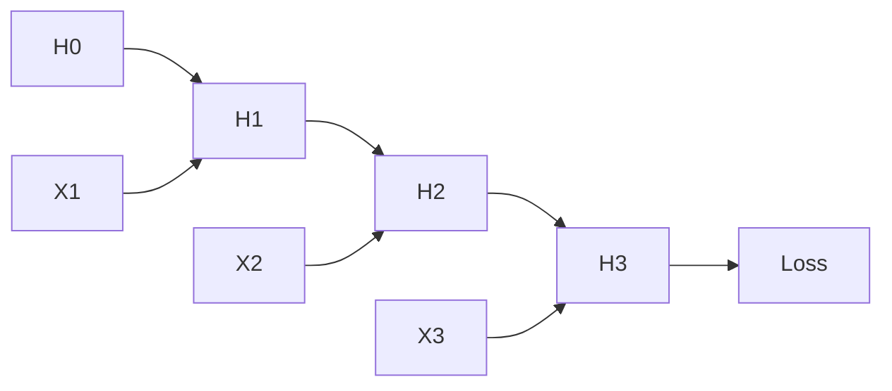

---

### 4. Vanishing Gradients

Occurs when:

[
|W_h| < 1
]

Repeated multiplication makes gradients → 0.

Effects:

* Early layers learn slowly
* Long-term dependency lost

---

### 5. Exploding Gradients

Occurs when:

[
|W_h| > 1
]

Gradients grow exponentially.

Effects:

* Unstable training
* Overflow errors

---

### 6. Solutions

* Gradient clipping
* LSTM/GRU
* Proper initialization
* Normalization

---

### 7. Conclusion

BPTT enables sequence learning but suffers from gradient problems due to repeated multiplications.

---

## **Question 3: Compare Bidirectional and Multilayer RNNs in terms of architecture and performance.**

### **Answer:**

### 1. Bidirectional RNN

Processes sequence in:

* Forward direction
* Backward direction

Uses future and past context.

---

### 2. Multilayer RNN

Stacked RNN layers.

Each layer processes output of previous layer.

---

### 3. Architectures

#### Bidirectional RNN

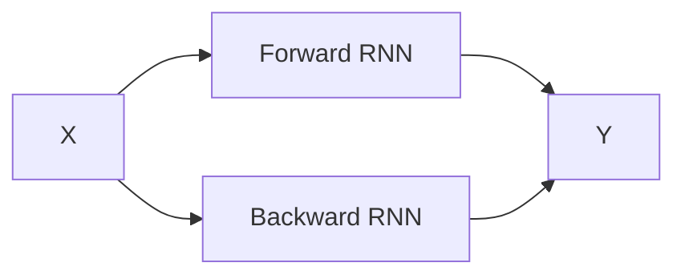

#### Multilayer RNN

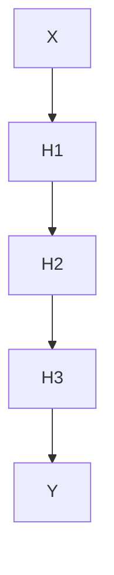

---

### 4. Comparison

| Aspect     | Bidirectional | Multilayer   |
| ---------- | ------------- | ------------ |
| Context    | Past + Future | Hierarchical |
| Complexity | High          | Moderate     |
| Accuracy   | High          | High         |
| Real-time  | Not suitable  | Suitable     |

---

### 5. Conclusion

Bidirectional RNNs provide richer context, while multilayer RNNs improve representational depth.

---

## **Question 4: Analyze the architecture of Echo-State Networks and evaluate the role of the reservoir.**

### **Answer:**

### 1. Introduction

Echo-State Networks (ESNs) are RNNs with a fixed hidden layer called a **reservoir**.

Only output weights are trained.

---

### 2. Architecture

Components:

* Input layer
* Reservoir
* Output layer

---

### 3. Diagram

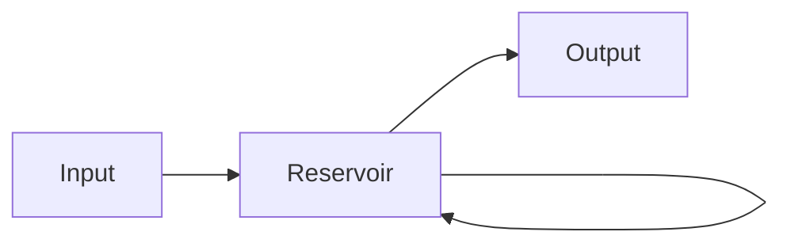

---

### 4. Role of Reservoir

* Large recurrent network
* Random fixed weights
* Generates dynamic states
* Captures temporal patterns

---

### 5. Advantages

* Fast training
* Simple optimization
* Low computation

---

### 6. Limitations

* Sensitive to initialization
* Limited adaptability

---

### 7. Conclusion

The reservoir acts as a dynamic memory that transforms input sequences into rich representations.

---

## **Question 5: Explain the operation of LSTM networks using gate-level equations.**

### **Answer:**

### 1. Introduction

Long Short-Term Memory (LSTM) networks overcome vanishing gradient problems using gated mechanisms.

---

### 2. LSTM Components

* Forget Gate
* Input Gate
* Output Gate
* Cell State

---

### 3. Gate Equations

#### Forget Gate

[
f_t = \sigma(W_f[x_t, h_{t-1}] + b_f)
]

#### Input Gate

[
i_t = \sigma(W_i[x_t, h_{t-1}] + b_i)
]

[
\tilde{C}*t = tanh(W_c[x_t, h*{t-1}] + b_c)
]

#### Cell State Update

[
C_t = f_t C_{t-1} + i_t \tilde{C}_t
]

#### Output Gate

[
o_t = \sigma(W_o[x_t, h_{t-1}] + b_o)
]

[
h_t = o_t tanh(C_t)
]

---

### 4. Diagram

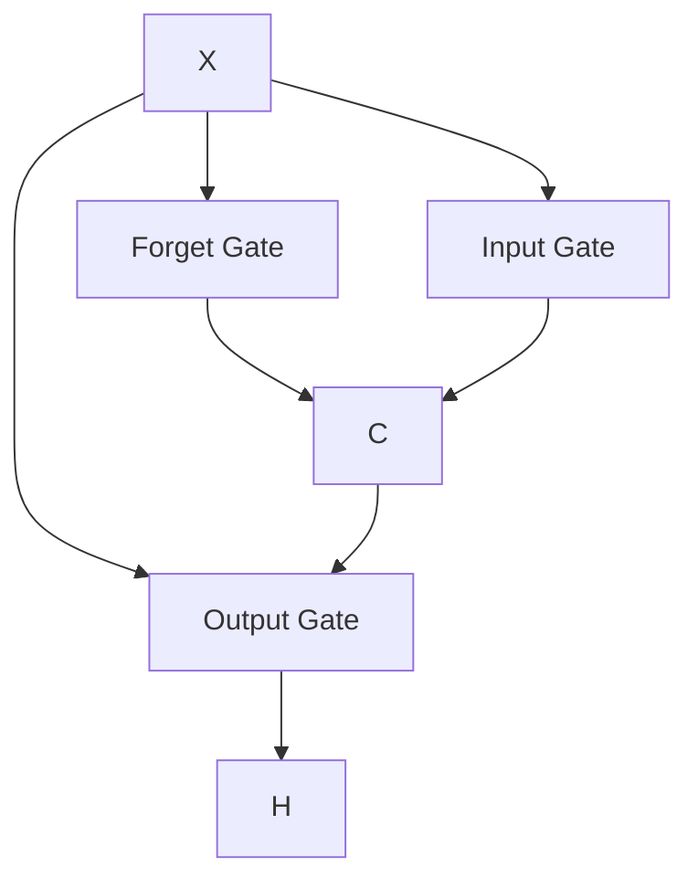

---

### 5. Conclusion

LSTM gates regulate information flow, enabling long-term memory retention.

---

## **Question 6: Evaluate GRUs against LSTMs in terms of complexity, training time, and performance.**

### **Answer:**

### 1. Introduction

Gated Recurrent Units (GRUs) are simplified versions of LSTMs.

---

### 2. GRU Structure

Uses:

* Update Gate
* Reset Gate

No separate cell state.

---

### 3. Comparison

| Aspect        | LSTM   | GRU        |
| ------------- | ------ | ---------- |
| Gates         | 3      | 2          |
| Parameters    | More   | Less       |
| Training Time | Slower | Faster     |
| Memory        | High   | Moderate   |
| Accuracy      | High   | Comparable |

---

### 4. Evaluation

GRUs are efficient and faster, while LSTMs handle long dependencies better.

---

### 5. Conclusion

GRUs are suitable for resource-limited systems; LSTMs are preferred for complex sequences.

---

## **Question 7: Describe an RNN-based Automatic Image Captioning pipeline integrating vision and text.**

### **Answer:**

### 1. Introduction

Image captioning generates textual descriptions from images using CNN + RNN.

---

### 2. Pipeline

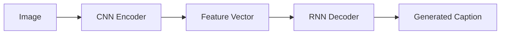

---

### 3. Explanation

* CNN extracts visual features
* RNN generates words sequentially
* Embedding layer encodes words
* Softmax predicts vocabulary

---

### 4. Conclusion

CNN-RNN integration enables effective vision-to-language translation.

---

## **Question 8: Develop a conceptual model for Temporal Recommender Systems using RNNs and justify its benefits.**

### **Answer:**

### 1. Introduction

Temporal recommender systems consider time-dependent user behavior.

---

### 2. Model Architecture

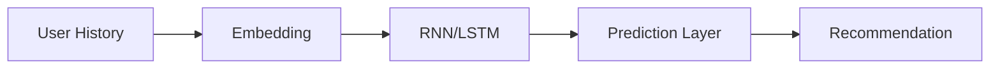

---

### 3. Benefits

* Captures sequential preferences
* Adapts to user trends
* Improves personalization
* Handles temporal drift

---

### 4. Conclusion

RNN-based models enhance recommendation accuracy by modeling user behavior over time.

---

## **Question 9: Explain the sequence-to-sequence approach for End-to-End Speech Recognition using RNNs.**

### **Answer:**

### 1. Introduction

Sequence-to-Sequence (Seq2Seq) models map input sequences to output sequences.

Used in speech recognition.

---

### 2. Architecture

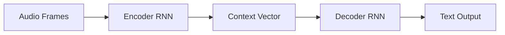

---

### 3. Working

* Encoder processes speech
* Context vector summarizes
* Decoder generates text
* Attention improves alignment

---

### 4. Conclusion

Seq2Seq models enable end-to-end speech recognition without manual feature design.

---

## **Question 10: Assess why sequential modeling is essential for Secondary Protein Structure Prediction using RNNs.**

### **Answer:**

### 1. Introduction

Protein structure depends on amino acid sequences.

RNNs model long-range dependencies.

---

### 2. Need for Sequential Modeling

* Residue interactions
* Contextual dependency
* Folding patterns

---

### 3. RNN-Based Model

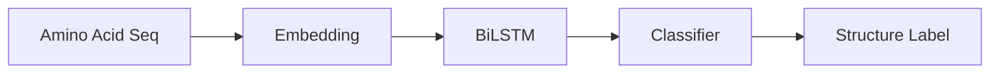

---

### 4. Conclusion

Sequential modeling is essential for capturing biochemical dependencies in proteins.

---

## **Question 11: Design an RNN-based framework for Handwriting Recognition and propose suitable evaluation metrics.**

### **Answer:**

### 1. Framework

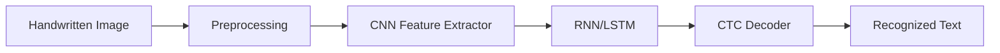

---

### 2. Explanation

* CNN extracts spatial features
* RNN models sequence
* CTC decodes characters

---

### 3. Evaluation Metrics

#### (a) Character Error Rate (CER)

[
CER = \frac{S+D+I}{N}
]

#### (b) Word Error Rate (WER)

[
WER = \frac{S+D+I}{N}
]

Where:

* S = Substitution
* D = Deletion
* I = Insertion
* N = Total words

---

### 4. Conclusion

CNN-RNN-CTC framework enables accurate handwriting recognition.

---

## **Question 12: Propose an RNN-based prototype addressing a societal/industrial problem and justify expected outcomes.**

### **Answer:**

### 1. Application: Disaster Prediction System

Predict floods and landslides using time-series data.

---

### 2. Architecture

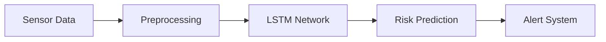

---

### 3. Justification

* Models temporal patterns
* Early warning capability
* Saves lives
* Improves disaster management

---

### 4. Expected Outcomes

* Accurate predictions
* Reduced damage
* Improved response time

---

### 5. Conclusion

RNN-based disaster systems provide reliable, real-time predictive intelligence.

---

Below are **detailed exam-oriented answers for UNIT–V**, prepared strictly according to your instructions and based on the uploaded syllabus. 

All questions are written exactly as given, answers are in **5-mark exam format**, and diagrams (where required) are provided in **Mermaid syntax**.

---

# ✅ **UNIT – V : REINFORCEMENT LEARNING AND BANDIT PROBLEMS**

---

## **Question 1: Define Reinforcement Learning (RL) and state two features that differentiate it from supervised learning.**

### **Answer:**

### 1. Definition of Reinforcement Learning

Reinforcement Learning (RL) is a type of machine learning in which an **agent learns by interacting with an environment** and receiving **feedback in the form of rewards or penalties**.

The agent aims to maximize cumulative reward over time.

---

### 2. Differentiating Features

#### (a) No Labeled Data

* Supervised Learning: Uses labeled input-output pairs.
* RL: No explicit labels; learns from reward signals.

#### (b) Sequential Decision Making

* RL actions affect future states.
* Supervised learning treats samples independently.

---

### 3. Comparison Table

| Feature  | Supervised Learning | Reinforcement Learning |
| -------- | ------------------- | ---------------------- |
| Labels   | Present             | Absent                 |
| Feedback | Immediate           | Delayed                |
| Learning | Static              | Interactive            |

---

### 4. Conclusion

RL differs from supervised learning by using reward-based feedback and learning through continuous interaction.

---

## **Question 2: List the main components of an RL system.**

### **Answer:**

### Main Components

1. Agent
2. Environment
3. State (S)
4. Action (A)
5. Reward (R)
6. Policy (π)
7. Value Function (V/Q)

---

### Diagram

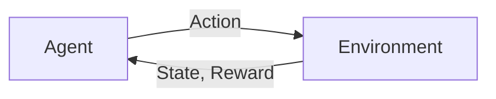

---

### Explanation

* Agent: Learner
* Environment: Surroundings
* State: Current situation
* Action: Decision
* Reward: Feedback
* Policy: Decision rule
* Value Function: Expected reward

---

### Conclusion

These components together enable learning through interaction.

---

## **Question 3: Outline the basic RL learning loop using a simple task.**

### **Answer:**

### 1. Learning Loop Steps

1. Observe state
2. Select action
3. Execute action
4. Receive reward
5. Update policy
6. Repeat

---

### Example: Robot in Maze

* State: Position
* Action: Move
* Reward: +10 (exit), -1 (wall)

---

### Diagram

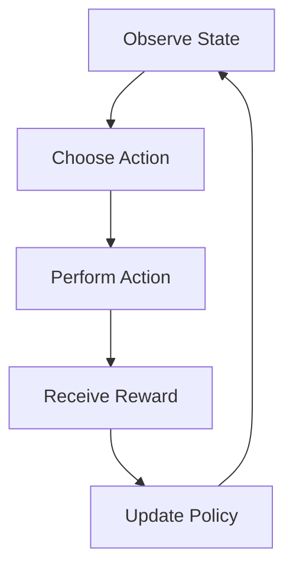

---

### Conclusion

The RL loop enables continuous improvement through trial and error.

---

## **Question 4: Define a reward signal and value function in RL.**

### **Answer:**

### 1. Reward Signal

A reward signal is a **numerical feedback** given by the environment to evaluate an action.

* Positive → Good action
* Negative → Bad action

Example: +1 for win, -1 for loss

---

### 2. Value Function

Value function estimates **expected cumulative reward**.

#### State Value:

[
V(s) = E[R_t | s_t = s]
]

#### Action Value:

[
Q(s,a) = E[R_t | s_t = s, a_t = a]
]

---

### 3. Conclusion

Reward guides behavior; value function predicts long-term benefits.

---

## **Question 5: Identify two challenges commonly faced in RL.**

### **Answer:**

### 1. Exploration vs Exploitation

* Exploration: Trying new actions
* Exploitation: Using known best actions

Balancing both is difficult.

---

### 2. Sparse Rewards

* Rewards given rarely
* Slow learning
* Poor guidance

---

### 3. Conclusion

These challenges affect learning speed and stability.

---

## **Question 6: State the objective of the Multi-Armed Bandit problem.**

### **Answer:**

### Objective

The objective of the Multi-Armed Bandit problem is to **maximize total reward over time** by selecting the best arm while balancing exploration and exploitation.

---

### Explanation

* Each arm gives random reward
* Unknown distributions
* Agent must learn optimal arm

---

### Mathematical Form

[
Maximize \sum_{t=1}^{T} R_t
]

---

### Conclusion

The goal is optimal long-term reward maximization.

---

## **Question 7: Compare Naïve and Greedy algorithms in the context of bandit problems.**

### **Answer:**

### Naïve Algorithm

* Selects arms randomly
* No learning
* Simple implementation

---

### Greedy Algorithm

* Selects best-known arm
* Exploits current knowledge
* No exploration

---

### Comparison Table

| Feature     | Naïve | Greedy   |
| ----------- | ----- | -------- |
| Learning    | No    | Yes      |
| Exploration | Full  | None     |
| Performance | Low   | Moderate |

---

### Conclusion

Naïve explores blindly; Greedy exploits without exploration.

---

## **Question 8: Summarize the idea behind Upper Confidence Bound (UCB) methods.**

### **Answer:**

### 1. Idea of UCB

UCB selects arms based on **optimism in the face of uncertainty**.

It balances:

* High reward
* High uncertainty

---

### 2. UCB Formula

[
UCB(a) = \bar{X}_a + \sqrt{\frac{2\ln t}{N_a}}
]

Where:

* ( \bar{X}_a ) = Average reward
* ( N_a ) = Times selected
* ( t ) = Time step

---

### 3. Conclusion

UCB encourages exploration of uncertain arms.

---

## **Question 9: List the key elements of the RL framework: agent, environment, states, actions, and rewards.**

### **Answer:**

### Key Elements

1. Agent: Decision maker
2. Environment: External world
3. States: Situation description
4. Actions: Possible moves
5. Rewards: Performance feedback

---

### Diagram

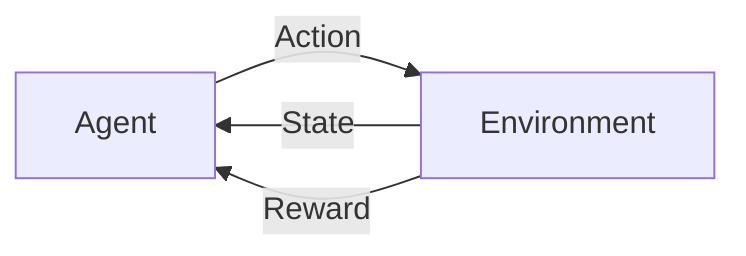

---

### Conclusion

These elements define the RL interaction cycle.

---

## **Question 10: Identify the role of policy in RL.**

### **Answer:**

### Definition

A policy is a **mapping from states to actions**.

[
\pi(s) = a
]

---

### Role

* Guides agent behavior
* Determines action selection
* Improves with learning

---

### Types

* Deterministic
* Stochastic

---

### Conclusion

Policy controls decision-making in RL.

---

## **Question 11: Outline how RL can be used to play Tic-Tac-Toe.**

### **Answer:**

### 1. Environment Setup

* Board = State
* Moves = Actions
* Win/Loss = Reward

---

### 2. Learning Process

* Start random
* Play many games
* Update Q-values
* Improve strategy

---

### Diagram

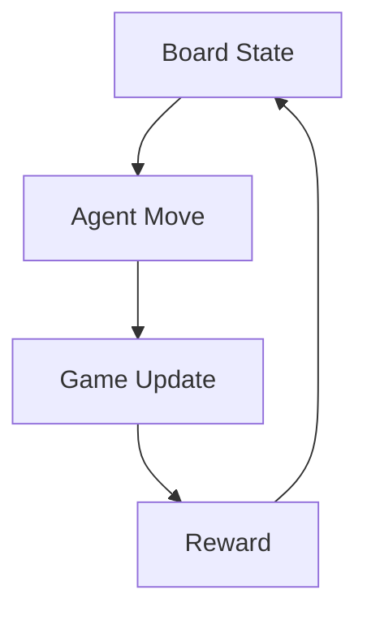

---

### 3. Conclusion

RL learns optimal play through repeated self-play.

---

## **Question 12: State how Deep Learning contributes to Reinforcement Learning.**

### **Answer:**

### Contribution

Deep Learning provides **neural networks to approximate policies and value functions**.

---

### Examples

* Deep Q-Networks (DQN)
* Policy Networks

---

### Benefits

* Handles large state spaces
* Learns features automatically
* Improves scalability

---

### Conclusion

Deep Learning enables RL to solve complex problems.

---

## **Question 13: List two advantages of Deep RL in real-world systems.**

### **Answer:**

### Advantages

1. Handles High-Dimensional Data
   Example: Images, videos, sensors

2. Autonomous Learning
   Minimal human intervention

---

### Conclusion

Deep RL supports intelligent automation.

---

## **Question 14: Identify two risks or limitations when deploying Deep RL systems.**

### **Answer:**

### Risks

1. High Training Cost

   * Needs GPUs
   * Long training time

2. Unstable Behavior

   * Unexpected actions
   * Safety concerns

---

### Conclusion

Deployment requires careful monitoring.

---

## **Question 15: Explain the term “stateless algorithm” in the context of RL.**

### **Answer:**

### Definition

A stateless algorithm does **not store past information** and makes decisions based only on current input.

---

### In RL Context

* No memory of past states
* No value table
* Example: Random policy

---

### Characteristics

| Feature      | Stateless |
| ------------ | --------- |
| Memory       | No        |
| Learning     | Minimal   |
| Adaptability | Low       |

---

### Conclusion

Stateless algorithms are simple but inefficient for complex RL tasks.

---
